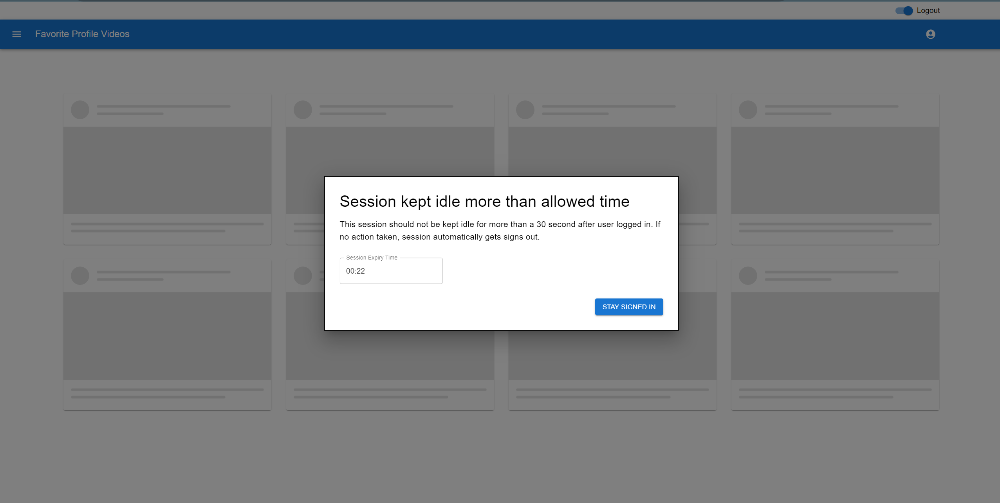

# Application-Idle-TimeTracker_react-idle-timer

Tracks user interaction and identifies if application left without any user interaction for certain time and logs out of the application.

- React
- Typescript
- react-idle-timer

Ref: Working application gif available within `./browser-idle-timeTracker/resource/`

